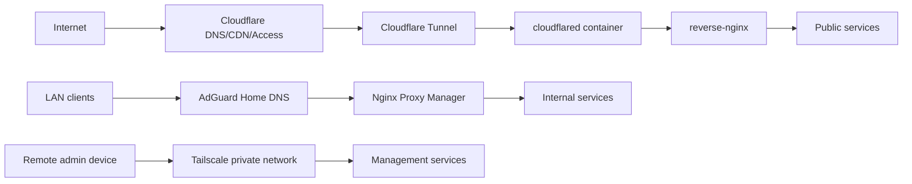

# HomeLab Infrastructure

基于 Docker、Nginx、Cloudflare Tunnel、Tailscale 与内网 DNS 的家庭轻量服务器实验平台。

这个仓库用于公开展示 HomeLab 的架构设计、服务分层、安全边界和运维思路。仓库中的配置均为脱敏样例，不包含真实密钥、后台入口、内网地址表或 Tailscale 设备信息。

## 项目目标

- 使用旧笔记本搭建低成本家庭服务器。
- 使用 Docker Compose 管理自托管服务。
- 将公网展示、内网访问、私有管理三类链路分离。
- 使用 Cloudflare Tunnel 避免家庭宽带直接开放 80/443 端口。
- 使用 Tailscale 保护 SSH、Portainer、管理后台等高风险入口。
- 使用 Uptime Kuma 建立基础服务可观测能力。

## 技术栈

| 分类 | 技术 |
| --- | --- |
| 容器化 | Docker, Docker Compose, Portainer |
| 公网入口 | Cloudflare DNS, Cloudflare Tunnel, Cloudflare Access |
| 反向代理 | Nginx, Nginx Proxy Manager |
| 内网 DNS | AdGuard Home |
| 私有远程管理 | Tailscale |
| 监控 | Uptime Kuma |
| 应用服务 | Halo, Homepage |

## 架构概览

三条访问链路：

| 场景 | 链路 | 适合服务 |
| --- | --- | --- |
| 公网展示 | Internet -> Cloudflare -> Tunnel -> cloudflared -> reverse-nginx -> public services | 博客前台、公开状态页 |
| 内网访问 | LAN -> AdGuard Home -> Nginx Proxy Manager -> internal services | Homepage、NPM、AdGuard、Kuma 后台 |
| 私有管理 | Remote device -> Tailscale -> management services | SSH、Portainer、后台管理面 |

## 核心设计亮点

### 双 Nginx 分流

公网和内网使用两套入口：

- `reverse-nginx` 负责公网链路，配置可读、可审计，适合精细化控制域名、路径、只读状态页和后续 upstream 负载均衡实验。
- `Nginx Proxy Manager` 负责内网链路，适合在局域网内快速维护 `*.yuu.lan` 服务入口。

如果用传统 DNS 的内外网分流方案，通常还要额外维护一台 DNS 服务器来做分视图解析或局域网重写。考虑到稳定性、维护成本和本项目的轻量化目标，这条路没有采用，所以把分流职责直接落在双 Nginx 上。这样既能保留清晰的公网和内网边界，也不需要再单独维护一套 DNS 基础设施。

更多说明见 [双 Nginx 分流设计](docs/dual-nginx-design.md)。

### 容器网络隔离

公网入口相关容器使用独立 Docker `proxy` 网络：

- `cloudflared` 接收 Cloudflare Tunnel 流量。
- `reverse-nginx` 在 `proxy` 网络内按域名转发。
- 只有需要被公网展示的后端服务加入 `proxy` 网络。
- Portainer、AdGuard Home、NPM 管理面等服务不进入公网反代链路。

更多说明见 [Docker 网络隔离设计](docs/docker-network-isolation.md)。

## 公开边界

本仓库保留 `yuuyan.top` 作为公网展示域名案例，但隐藏以下信息：

- Cloudflare Tunnel token、API token、Access 详细策略。
- Tailscale 真实 IP、设备名、auth key。
- 内网真实 IP 地址表。
- 管理后台真实域名、真实路径。
- 数据库密码、`.env`、证书私钥。
- Mihomo 订阅、节点或代理配置。

## 目录说明

| 路径 | 说明 |
| --- | --- |
| `docs/` | 架构、安全、运维、故障排查和路线图文档 |
| `diagrams/` | Mermaid 架构图源码 |
| `examples/compose/` | 脱敏后的 Docker Compose 样例 |
| `examples/nginx/` | 脱敏后的 Nginx 反代样例 |
| `examples/dns/` | 内网 DNS rewrite 说明样例 |
| `assets/screenshots/` | 可公开截图占位目录 |

## 当前状态

- [x] Docker 基础服务部署思路整理
- [x] Cloudflare Tunnel 公网接入链路整理
- [x] 双 Nginx 分流设计整理
- [x] Docker `proxy` 网络隔离设计整理
- [x] Uptime Kuma 公开状态页与后台分离思路整理
- [ ] 补充更多公开截图和服务示意
- [ ] 自动化备份方案
- [ ] 日志分析方案
- [ ] Nginx upstream 多实例实验
- [ ] LVS-DR 实验

## License

本仓库使用 MIT License。示例配置仅用于学习和展示，请根据自己的网络环境修改后再使用。
