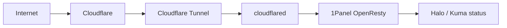
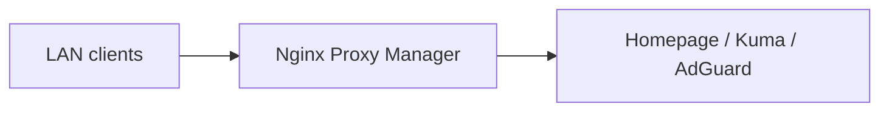
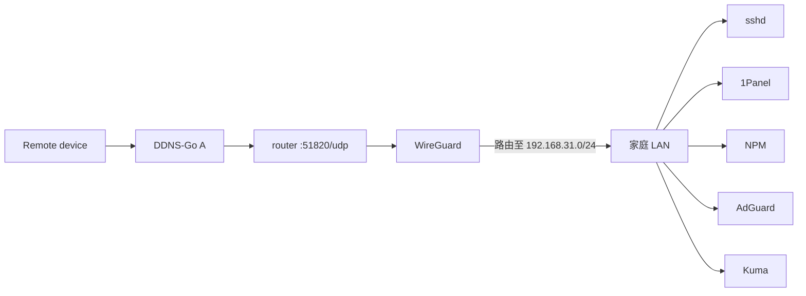

# HomeLab Infrastructure

基于 Docker、1Panel、Cloudflare Tunnel、WireGuard + DDNS-Go 和内网 DNS 的家庭服务器实验仓库。

## 项目总览

这个仓库记录我的 HomeLab 结构、访问边界和脱敏配置样例。

## 项目目标

- 使用旧笔记本搭建低成本家庭服务器。
- 使用 Docker Compose 管理自托管服务，通过 1Panel 集成面板统一管理。
- 将公开访问、内网访问、私有管理三类链路分离。
- 使用 Cloudflare Tunnel 避免家庭宽带直接开放 80/443 端口。
- 使用 WireGuard + DDNS-Go 保护 SSH、1Panel、管理后台等高风险入口。
- 使用 Uptime Kuma 建立基础服务可观测能力。

## 技术栈

| 分类 | 技术 |
| --- | --- |
| 容器化 | Docker, Docker Compose, 1Panel |
| 公网入口 | Cloudflare DNS, Cloudflare Tunnel, Cloudflare Access |
| 反向代理 | 1Panel OpenResty（公网）, Nginx Proxy Manager（内网） |
| 内网 DNS | AdGuard Home |
| 私有远程管理 | WireGuard (host) + DDNS-Go (Docker) |
| 监控 | Uptime Kuma |
| 应用服务 | Halo, Homepage |
| 运维工具集成 | Model Context Protocol (MCP), ssh2, 1Panel API, OpenClaw |

## 三条访问链路

| 场景 | 路径 | 典型服务 |
| --- | --- | --- |
| 公开访问 | `Internet -> Cloudflare -> Tunnel -> cloudflared -> 1Panel OpenResty -> service` | Halo 前台、Uptime Kuma 状态页 |
| 内网访问 | `LAN -> Nginx Proxy Manager -> service` | Homepage、Kuma 后台、AdGuard 管理页 |
| 私有管理 | `Remote device -> DDNS-Go A -> router :51820/udp -> WireGuard -> service` | SSH、1Panel、全部管理面板（接入即获得 LAN 等价访问） |

## 架构图

公开访问：

内网访问：

私有管理：

## 访问与安全边界

HomeLab 的安全目标是减少公网暴露面。不同风险等级的服务放在不同入口里，不混在一条链路上。

| 等级 | 服务类型 | 访问方式 |
| --- | --- | --- |
| 公开访问 | 博客前台、公开状态页 | `yuuyan.top` 子域名 |
| 认证访问 | 偶尔需要外部访问的入口 | Cloudflare Access |
| 私有管理 | SSH、1Panel、AdGuard、NPM、后台面板 | LAN 或 WireGuard VPN |

公网只放低风险内容：

- Halo 前台可以公开。
- Uptime Kuma 只公开状态页，不公开控制台。
- Homepage 如果展示内部服务清单，只放在内网入口。

所有公网 Web 流量先经过 Cloudflare，再通过 Tunnel 进入内网。家庭宽带侧只对外暴露 51820/udp（WireGuard）。WireGuard + DDNS-Go 用于 SSH、1Panel、NPM、AdGuard Home 和 Uptime Kuma 控制台这类私有管理入口。DDNS-Go 负责动态更新 WireGuard 端点域名，不作为公网服务暴露。

## 设计亮点

- 双入口：1Panel OpenResty 处理公网，NPM 处理内网，DNS 不承担分流主逻辑。
- Docker 网络按链路拆分：`public_proxy`（外网入口层）和 `internal_proxy`（内网入口层），降低管理服务误暴露概率。
- Uptime Kuma 状态页和后台控制台分开，公网只放低风险只读内容。
- WireGuard 是 L3 网络层接入：客户端连接后路由至家庭 LAN 网段，管理服务不需要单独配置远程访问路径，新增服务自动可达。
- MCP 运维工具：通过 SSH、1Panel V2 API 和 OpenClaw CLI 提供主机诊断、容器/面板查询和 OpenClaw 部署管理能力，限定白名单主机和服务，不开放任意 shell 执行。

详细说明见 [双入口架构设计](docs/dual-nginx-design.md)。

## 目录入口

| 路径 | 说明 |
| --- | --- |
| [docs/dual-nginx-design.md](docs/dual-nginx-design.md) | 双入口架构：1Panel OpenResty（公网）+ NPM（内网）+ 双 Docker 网络 |
| [docs/wireguard-ddnsgo-design.md](docs/wireguard-ddnsgo-design.md) | WireGuard + DDNS-Go 私有管理链路设计 |
| [docs/wireguard-ddnsgo-deployment.md](docs/wireguard-ddnsgo-deployment.md) | WireGuard + DDNS-Go 部署记录 |
| [docs/mcp-ops-account.md](docs/mcp-ops-account.md) | MCP 运维专用账号方案 |
| [docs/operations-guide.md](docs/operations-guide.md) | 日常维护与故障排查 |
| [mcp/README.md](mcp/README.md) | HomeLab MCP 运维服务说明 |
| [mcp/docs/personal-ops-assistant.md](mcp/docs/personal-ops-assistant.md) | MCP 个人运维助手设计 |
| [CHANGELOG.md](CHANGELOG.md) | 版本变更记录 |
| [examples/compose/](examples/compose/) | 脱敏后的 Compose 样例 |
| [examples/nginx/](examples/nginx/) | 脱敏后的 Nginx 反代样例 |
| [examples/dns/](examples/dns/) | 内网 DNS rewrite 样例 |

## 当前进度

已完成：

- [x] HomeLab 总体架构文档。
- [x] 公网、内网、私有管理三条链路拆分。
- [x] 双入口 + 双 Docker 网络设计（`public_proxy` / `internal_proxy`）。
- [x] 公开样例配置。
- [x] 私有管理链路从 Tailscale 迁移至 WireGuard + DDNS-Go。
- [x] 外网入口从原生 Nginx 迁移至 1Panel OpenResty，Docker 管理统一到 1Panel。
- [x] MCP 运维服务：SSH 诊断、systemd 管理、Docker/Compose 操作、1Panel API 查询、OpenClaw 管理。

待补充：

- [ ] 脱敏截图和服务关系示意。
- [ ] AdGuard Home DNS rewrite 实际维护经验。
- [ ] 自动化备份策略。
- [ ] 日志分析流程。
- [ ] 服务升级与回滚流程。
- [ ] 关键服务告警渠道。
- [ ] 内网域名（`*.yuu.lan`）恢复启用。

## License

本仓库使用 MIT License。示例配置仅用于参考，请根据自己的网络环境修改后再使用。
