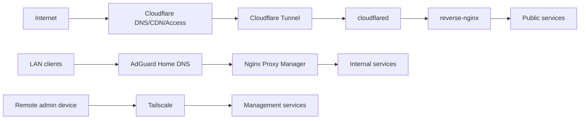

# HomeLab Infrastructure

基于 Docker、Nginx、Cloudflare Tunnel、Tailscale 和内网 DNS 的家庭服务器实验仓库。

## 项目总览

这个仓库记录我的 HomeLab 结构、访问边界和脱敏配置样例。真实配置保留在本地环境，仓库里不放真实密钥、后台入口、内网地址表或 Tailscale 设备信息。

## 项目目标

- 使用旧笔记本搭建低成本家庭服务器。
- 使用 Docker Compose 管理自托管服务。
- 将公开访问、内网访问、私有管理三类链路分离。
- 使用 Cloudflare Tunnel 避免家庭宽带直接开放 80/443 端口。
- 使用 Tailscale 保护 SSH、Portainer、管理后台等高风险入口。
- 使用 Uptime Kuma 建立基础服务可观测能力。

## 技术栈

| 分类 | 技术 |
| --- | --- |
| 容器化 | Docker, Docker Compose, Portainer |
| 公网入口 | Cloudflare DNS, Cloudflare Tunnel, Cloudflare Access |
| 反向代理 | Nginx, Nginx Proxy Manager |
| 内网 DNS | AdGuard Home |
| 私有远程管理 | Tailscale |
| 监控 | Uptime Kuma |
| 应用服务 | Halo, Homepage |

## 三条访问链路

| 场景 | 路径 | 典型服务 |
| --- | --- | --- |
| 公开访问 | `Internet -> Cloudflare -> Tunnel -> cloudflared -> reverse-nginx -> service` | Halo 前台、Uptime Kuma 状态页 |
| 内网访问 | `LAN -> AdGuard Home -> Nginx Proxy Manager -> service` | Homepage、Kuma 后台、AdGuard 管理页 |
| 私有管理 | `Remote device -> Tailscale -> home-server -> service` | SSH、Portainer、后台面板 |

## 架构图

## 设计亮点

- 双 Nginx 入口：`reverse-nginx` 处理公网，NPM 处理内网，DNS 不承担分流主逻辑。
- Docker `proxy` 网络只连接需要被入口层访问的容器，降低管理服务误暴露概率。
- Uptime Kuma 状态页和后台控制台分开，公网只放低风险只读内容。

详细说明见 [为什么不用传统 DNS 分流，而是用两个 Nginx + proxy 网络](docs/dual-nginx-design.md)。

## 目录入口

| 路径 | 说明 |
| --- | --- |
| [docs/architecture.md](docs/architecture.md) | 总体架构与三条访问链路 |
| [docs/dual-nginx-design.md](docs/dual-nginx-design.md) | 为什么不用传统 DNS 分流，而是用两个 Nginx + proxy 网络 |
| [docs/docker-network-isolation.md](docs/docker-network-isolation.md) | Docker `proxy` 网络的隔离边界 |
| [docs/security-design.md](docs/security-design.md) | 服务分级与公开边界 |
| [docs/operations.md](docs/operations.md) | 日常维护与变更流程 |
| [docs/troubleshooting.md](docs/troubleshooting.md) | 常见故障排查路径 |
| [docs/roadmap.md](docs/roadmap.md) | 当前整理进度 |
| [examples/compose/](examples/compose/) | 脱敏后的 Compose 样例 |
| [examples/nginx/](examples/nginx/) | 脱敏后的 Nginx 反代样例 |
| [examples/dns/](examples/dns/) | 内网 DNS rewrite 样例 |

## License

本仓库使用 MIT License。示例配置仅用于参考，请根据自己的网络环境修改后再使用。
