# 总体架构

HomeLab 按三条访问链路拆分：公开访问、内网访问和私有管理。本页只放整体结构；两个 Nginx 和 DNS 分流的取舍，放在 [为什么不用传统 DNS 分流，而是用两个 Nginx + proxy 网络](dual-nginx-design.md)。

## 设计目标

- 公开访问只暴露低风险内容，减少家庭网络暴露面。
- 内网服务通过统一域名访问，避免记忆 IP 和端口。
- 管理服务通过局域网或 Tailscale 访问，不直接进入公网链路。
- Docker 网络按访问边界拆分，避免所有容器互相可达。

## 访问链路

| 链路 | 流量路径 | 典型服务 |
| --- | --- | --- |
| 公开访问 | `Internet -> Cloudflare -> Tunnel -> cloudflared -> reverse-nginx -> service` | Halo 前台、Uptime Kuma 状态页 |
| 内网访问 | `LAN -> AdGuard Home -> Nginx Proxy Manager -> service` | Homepage、Kuma 后台、AdGuard 管理页 |
| 私有管理 | `Remote device -> Tailscale -> home-server -> service` | SSH、Portainer、系统维护入口 |

## 架构图

```mermaid
flowchart TB
  subgraph Public["公开访问区"]
    internet[Internet]
    cf[Cloudflare DNS/CDN/Access]
    tunnel[Cloudflare Tunnel]
    cloudflared[cloudflared]
    reverse[reverse-nginx]
    blog[Halo blog]
    status[Uptime Kuma status page]
  end

  subgraph LAN["局域网访问区"]
    lanClient[LAN clients]
    adguard[AdGuard Home]
    npm[Nginx Proxy Manager]
    homepage[Homepage]
    internalKuma[Uptime Kuma dashboard]
  end

  subgraph Private["私有管理区"]
    remote[Remote admin device]
    tailscale[Tailscale]
    ssh[SSH]
    portainer[Portainer]
  end

  internet --> cf --> tunnel --> cloudflared --> reverse
  reverse --> blog
  reverse --> status

  lanClient --> adguard --> npm
  npm --> homepage
  npm --> internalKuma

  remote --> tailscale
  tailscale --> ssh
  tailscale --> portainer
```

## 服务分层

| 分层 | 说明 | 公开策略 |
| --- | --- | --- |
| 公开服务 | 面向外部用户的只读内容 | 可通过 `yuuyan.top` 子域名访问 |
| 认证服务 | 偶尔需要外部访问但不应完全公开 | 通过 Cloudflare Access 保护 |
| 私有管理服务 | 具备写权限或系统控制能力 | 仅局域网或 Tailscale 访问 |

## 文档边界

- 本页说明整体架构和三条访问链路。
- [dual-nginx-design.md](dual-nginx-design.md) 说明为什么不用传统 DNS 分流，而是使用两个 Nginx + `proxy` 网络。
- [docker-network-isolation.md](docker-network-isolation.md) 说明 Docker `proxy` 网络如何限制容器可达范围。
