# 总体架构

HomeLab 采用三条访问链路并行的设计：公网展示链路、内网访问链路、私有管理链路。三条链路命中不同入口，承担不同安全等级的服务访问。

## 设计目标

- 公网只暴露展示类服务，减少家庭网络暴露面。
- 内网服务通过统一域名访问，避免记忆 IP 和端口。
- 管理服务通过 Tailscale 或局域网访问，不直接进入公网链路。
- Docker 网络按访问边界拆分，避免所有容器互相可达。

## 访问链路

| 链路 | 流量路径 | 典型服务 |
| --- | --- | --- |
| 公网展示 | `Internet -> Cloudflare -> Tunnel -> cloudflared -> reverse-nginx -> service` | Halo 前台、Uptime Kuma 状态页 |
| 内网访问 | `LAN -> AdGuard Home -> Nginx Proxy Manager -> service` | Homepage、Kuma 后台、AdGuard 管理页 |
| 私有管理 | `Remote device -> Tailscale -> home-server -> service` | SSH、Portainer、系统维护入口 |

## 架构图

```mermaid
flowchart TB
  subgraph Public["公网展示区"]
    internet[Internet]
    cf[Cloudflare DNS/CDN/Access]
    tunnel[Cloudflare Tunnel]
    cloudflared[cloudflared]
    reverse[reverse-nginx]
    blog[Halo blog]
    status[Uptime Kuma status page]
  end

  subgraph LAN["局域网访问区"]
    lanClient[LAN clients]
    adguard[AdGuard Home]
    npm[Nginx Proxy Manager]
    homepage[Homepage]
    internalKuma[Uptime Kuma dashboard]
  end

  subgraph Private["私有管理区"]
    remote[Remote admin device]
    tailscale[Tailscale]
    ssh[SSH]
    portainer[Portainer]
  end

  internet --> cf --> tunnel --> cloudflared --> reverse
  reverse --> blog
  reverse --> status

  lanClient --> adguard --> npm
  npm --> homepage
  npm --> internalKuma

  remote --> tailscale
  tailscale --> ssh
  tailscale --> portainer
```

## 服务分层

| 分层 | 说明 | 公开策略 |
| --- | --- | --- |
| 公开服务 | 面向外部用户的只读或展示内容 | 可通过 `yuuyan.top` 子域名访问 |
| 认证服务 | 偶尔需要远程访问但不应完全公开 | 通过 Cloudflare Access 保护 |
| 私有管理服务 | 具备写权限或系统控制能力 | 仅局域网或 Tailscale 访问 |

## 关键取舍

公网使用原生 Nginx，是为了让配置文件可审计、便于拆分、适合后续学习 upstream 和负载均衡。内网使用 Nginx Proxy Manager，是为了提升日常维护效率。两者的职责边界明确，可以降低误配置风险，也避免了为了做传统 DNS 内外网分流而额外维护 DNS 服务器的复杂度。
