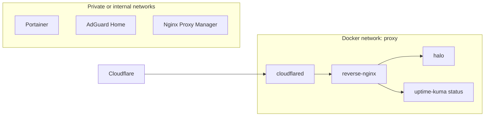

# Docker 网络隔离设计

Docker 网络隔离是本项目实现内外网边界的重要部分。核心思路是：公网入口链路只连接必要容器，管理服务不默认加入公网反代网络。

## 网络模型

公网链路使用一个外部 Docker 网络：

```bash
docker network create proxy
```

`proxy` 网络中只放入公网反代需要访问的容器：

- `cloudflared`
- `reverse-nginx`
- `halo`
- `uptime-kuma`，仅用于状态页反代
- 其他明确需要公开访问的服务

管理类服务默认不加入公网链路：

- Portainer
- AdGuard Home 管理面
- Nginx Proxy Manager 管理面
- SSH
- Mihomo 面板

## 流量路径



## 容器名访问

当服务加入同一个 Docker 网络后，`reverse-nginx` 可以通过容器名访问后端：

```nginx
proxy_pass http://halo:8090;
proxy_pass http://uptime-kuma:3001;
```

这样可以减少宿主机端口映射。对公网入口来说，不需要把每个后端服务都映射到宿主机端口。

## Compose 约定

公网相关服务使用外部 `proxy` 网络：

```yaml
networks:
  proxy:
    external: true
```

只有确实需要被 `reverse-nginx` 访问的服务才加入该网络。管理服务如果需要内网访问，应通过局域网入口或 Tailscale 访问。

## 安全收益

- 降低误暴露管理服务的概率。
- 公网反代只能访问明确加入 `proxy` 网络的后端。
- 宿主机端口映射更少，排查入口更清晰。
- 便于把公开服务、内网服务和管理服务分成不同风险等级。

## 注意事项

- Docker 网络隔离不能替代应用认证和访问控制。
- 加入 `proxy` 网络前，需要确认该服务是否真的应该被公网反代。
- Uptime Kuma 可以公开状态页，但后台控制台应通过内网或 Tailscale 访问。
- Portainer、NPM、AdGuard 管理面不应直接通过公网暴露。
