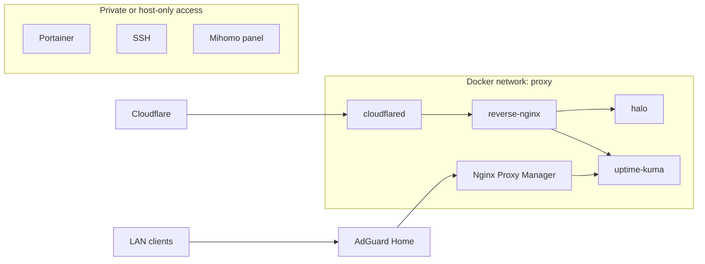

# Docker proxy 网络隔离

本页记录 Docker `proxy` 网络的隔离边界。两个 Nginx 和 DNS 分流的取舍见 [为什么不用传统 DNS 分流，而是用两个 Nginx + proxy 网络](dual-nginx-design.md)。

## 网络模型

公网和内网入口都要访问一部分后端服务，但不是所有服务都应该被反代看到。`proxy` 网络只放入口层需要访问的容器。

```bash
docker network create proxy
```

可以加入 `proxy` 网络的服务：

- `cloudflared`
- `reverse-nginx`
- `nginx-proxy-manager`
- `halo`
- `uptime-kuma`，仅用于状态页或内网控制台
- 其他明确需要被入口层访问的服务

默认不要放进公网反代路径的服务：

- Portainer
- AdGuard Home 管理面
- Nginx Proxy Manager 管理面
- SSH
- Mihomo 面板

## 流量路径



## 容器名访问

服务加入同一个 Docker 网络后，入口容器可以直接用容器名访问后端：

```nginx
proxy_pass http://halo:8090;
proxy_pass http://uptime-kuma:3001;
```

这样可以少开宿主机端口。入口层只需要在 Docker 网络里找到后端，不需要每个服务都映射到宿主机。

## Compose 约定

需要被入口层访问的服务声明外部 `proxy` 网络：

```yaml
networks:
  proxy:
    external: true
```

只有确实需要被 `reverse-nginx` 或 `Nginx Proxy Manager` 访问的服务才加入该网络。管理服务优先走局域网入口或 Tailscale。

## 安全收益

- 服务是否能被入口层访问，取决于是否显式加入网络。
- 公网反代只能访问已加入 `proxy` 网络的后端。
- 宿主机端口映射更少，入口排查范围更小。
- 公开服务、内网服务和管理服务可以按风险等级分开维护。

## 注意事项

- Docker 网络隔离不能替代应用认证和访问控制。
- 加入 `proxy` 网络前，要确认该服务是否真的应该被入口层访问。
- Uptime Kuma 可以公开状态页，但控制台应通过内网或 Tailscale 访问。
- Portainer、NPM、AdGuard 管理面不应直接通过公网暴露。
