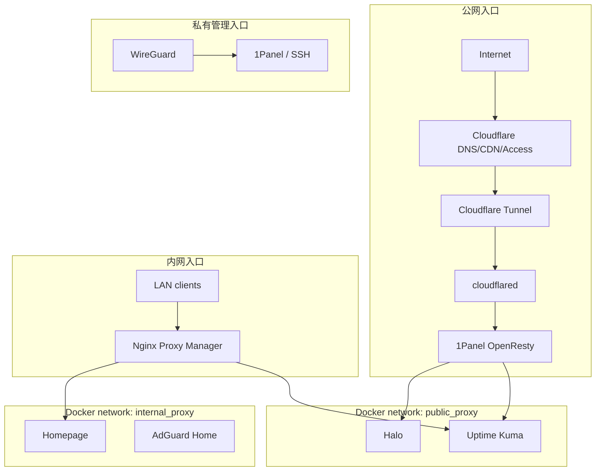

# 双入口架构

本文档覆盖公网和内网两条访问链路的设计决策、组件职责和配置方式。私有管理链路（WireGuard + DDNS-Go）见 [wireguard-ddnsgo-design.md](wireguard-ddnsgo-design.md)。

本项目没有采用"单套 DNS 视图 + 内外网分流"的做法，而是把分流放在入口层：公网入口交给 1Panel OpenResty（`public-openresty`），内网入口交给 Nginx Proxy Manager，后端服务通过 Docker 网络转发。

> **2026-06-26 迁移说明**：外网入口已从原生 `reverse-nginx` 迁移至 1Panel OpenResty，Docker 网络从单一 `proxy` 拆分为 `public_proxy`（外网）和 `internal_proxy`（内网），Portainer 已移除，Docker 管理统一到 1Panel。

## 为什么不用传统 DNS 分流

这是一个轻量 HomeLab，核心考量是两点：维护成本和可用性。

传统 DNS 分流需要额外跑一台 DNS 服务器（或在现有服务上配置分视图解析），一旦这台 DNS 出问题，整个访问链路都会受影响。对于轻量服务器来说，多一个需要保持在线的关键组件，就多一个故障点。

维护上也不轻松：公网域名和局域网域名要分别维护解析规则，同一个服务内外网都要访问时还需要按来源返回不同目标，规则变更时还要同步 DNS 配置。

把分流放到入口层后，DNS 只做最简单的事——把域名解析到入口 IP，不参与任何分流决策。排查路径也更短：公网问题看 1Panel OpenResty，内网问题看 NPM，两者互不干扰。

## 设计原则

- DNS 只负责把域名解析到入口，不负责判断请求应该走公网链路还是内网链路。
- 1Panel OpenResty（`public-openresty`）只处理公开访问，适合版本化配置、路径控制和只读状态页暴露。
- Nginx Proxy Manager 只处理内网访问，适合维护 `*.yuu.lan` 这类局域网入口（当前暂以 IP 直接访问）。
- Docker 网络按链路拆分：`public_proxy`（外网入口层）和 `internal_proxy`（内网入口层），服务是否能被反代由网络归属决定。

## 方案结构



公网链路只放公开内容，比如 Halo 前台和 Uptime Kuma 状态页。1Panel OpenResty 按域名、路径和响应策略做限制，不处理内网服务，也不承载管理面板。

内网链路服务局域网设备，比如 Homepage、Kuma 后台和 AdGuard 管理页。当前内网域名（`*.yuu.lan`）暂未启用，服务通过 `192.168.31.178` 直接访问。

私有管理链路通过 WireGuard VPN 接入，不经过任何 Nginx 入口。客户端连接后路由至家庭 LAN 网段，1Panel、NPM 后台、AdGuard 管理面等服务直接通过内网地址访问，不需要为每个服务单独配置访问路径。

### 职责边界

| 组件 | 负责什么 | 不负责什么 |
| --- | --- | --- |
| Cloudflare | 公网 DNS、Tunnel、Access | 内网服务分流 |
| AdGuard Home | 局域网 DNS rewrite | 公网访问策略 |
| 1Panel OpenResty | 公开域名、路径限制、公开状态页 | 内网管理入口 |
| Nginx Proxy Manager | `*.yuu.lan` 内网入口 | 公网暴露策略 |
| Docker `public_proxy` 网络 | 外网入口层到后端容器的可达面 | 内网服务访问 |
| Docker `internal_proxy` 网络 | 内网入口层到后端容器的可达面 | 公网暴露策略 |
| WireGuard + DDNS-Go | 私有管理入口（SSH、1Panel、后台面板）| 公网访问、内网服务分流 |

## Docker 网络怎么配合

Docker 网络按链路拆分为两个，给入口层提供稳定的后端可达面。服务加入同一个 Docker 网络后，入口容器可以直接用容器名访问后端：

```nginx
proxy_pass http://halo:8090;
proxy_pass http://uptime-kuma:3001;
```

这样可以少开宿主机端口。入口层只需要在 Docker 网络里找到后端，不需要每个服务都映射到宿主机。

创建外部网络：

```bash
docker network create public_proxy
docker network create internal_proxy
```

Compose 中声明外部网络：

```yaml
networks:
  public_proxy:
    external: true
  internal_proxy:
    external: true
```

**`public_proxy` 成员**（外网入口链路）：

- `cloudflared`
- `1Panel-openresty-M3iP`（1Panel OpenResty）
- `halo`
- `uptime-kuma`

**`internal_proxy` 成员**（内网入口链路）：

- `nginx-proxy-manager`
- `homepage`
- `adguardhome`
- `halo`
- `uptime-kuma`

这些服务不应加入任何入口网络，因为它们属于管理面，加入后会绕过 WireGuard 访问边界：

- AdGuard Home 管理面
- Nginx Proxy Manager 管理面
- SSH
- 1Panel 管理面
- Mihomo 面板

## 配置组织

公网入口配置由 1Panel 管理，存放在：

```text
/opt/1panel/www/conf.d/
├── blog.yuuyan.top.conf
├── status.yuuyan.top.conf
├── halo-admin.conf
└── yuuyan.top.conf
```

反向代理规则按 1Panel 标准拆到各站点目录：

```text
/opt/1panel/www/sites/
├── blog.yuuyan.top/proxy/root.conf
├── halo-admin/proxy/root.conf
└── status.yuuyan.top/proxy/root.conf
```

静态站点文件：

```text
/opt/1panel/www/sites/yuuyan.top/index/
```

内网入口围绕 `*.yuu.lan` 组织（当前暂未启用，以 IP 直接访问）：

```text
npm.yuu.lan     (暂以 192.168.31.178:81 访问)
adguard.yuu.lan (暂以 192.168.31.178:8082 访问)
```

Compose 目录布局见[运维指南 · 目录约定](operations-guide.md#目录约定)。

## 运维约束

- 公开入口和内网入口分开维护。
- 只有需要被入口层访问的服务才加入对应网络（`public_proxy` 或 `internal_proxy`）。
- Docker 网络隔离不能替代应用认证和访问控制。
- 管理面板默认不进入公网链路，通过 WireGuard VPN 访问。
- Uptime Kuma 可以公开状态页，但控制台应通过内网或 WireGuard VPN 访问。
- 1Panel 编辑站点或 HTTPS 策略时可能按模板重写配置，重点检查 `blog.yuuyan.top` 的 `/console`/`/uc` 拦截规则和 HTTPS 策略（保持 `HTTPAlso`，不要改为 `HTTPToHTTPS`）。
- Cloudflare Tunnel 回源保持 `http://public-openresty:80`，避免 SNI/证书校验问题。

具体变更步骤见[运维指南 · 配置变更流程](operations-guide.md#配置变更流程)。

## 相关文档

- [README.md](../README.md)
- [运维指南](operations-guide.md)
- [Nginx 示例配置](../examples/nginx/)
- [Compose 示例](../examples/compose/)
