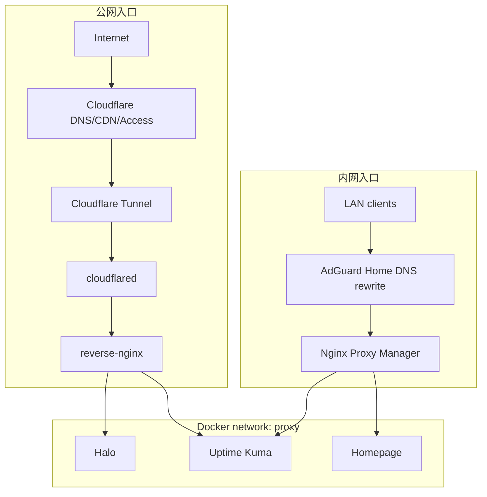

# 为什么不用传统 DNS 分流，而是用两个 Nginx + proxy 网络

本项目没有采用“单套 DNS 视图 + 内外网分流”的做法。传统 DNS 分流通常要额外维护一台 DNS 服务器，用来处理分视图解析、局域网重写和规则同步；这部分成本对当前 HomeLab 不划算。

当前方案把分流放在入口层。公网入口交给 `reverse-nginx`，内网入口交给 Nginx Proxy Manager，后端服务通过 Docker `proxy` 网络转发。

## 设计结论

- DNS 只负责把域名解析到入口，不负责判断请求应该走公网链路还是内网链路。
- `reverse-nginx` 只处理公开访问，适合版本化配置、路径控制和只读状态页暴露。
- Nginx Proxy Manager 只处理内网访问，适合维护 `*.yuu.lan` 这类局域网入口。
- Docker `proxy` 网络只放入口层需要访问的容器，服务是否能被反代由网络归属决定。

## 为什么不用传统 DNS 分流

传统 DNS 分流的代价不是解析本身，而是多维护一台 DNS 服务器。对这个 HomeLab 来说，成本不只是一项服务，还包括后续规则维护、故障排查和配置同步。

常见做法是公网域名走一套解析，局域网域名走另一套解析；如果同一个服务内外网都要访问，还可能需要按来源网络返回不同目标。这样一来，DNS 要同时处理解析、策略、缓存和变更同步。

维护时常见的问题包括：

- 客户端缓存的解析结果和当前配置不一致。
- 内外网切换后，域名解析目标不符合预期。
- 公开入口和局域网入口变更时，还要同步 DNS 规则。
- DNS 规则出错时，影响面会扩大到整条访问链路。

把分流放到入口层后，排查路径更短：公网问题看 `reverse-nginx`，内网问题看 NPM。

## 方案结构



### 公网链路

```text
Internet
  -> Cloudflare DNS/CDN/Access
  -> Cloudflare Tunnel
  -> cloudflared
  -> reverse-nginx
  -> public service
```

这条链路只放公开内容，比如 Halo 前台和 Uptime Kuma 状态页。`reverse-nginx` 按域名、路径和响应策略做限制，不处理内网服务，也不承载管理面板。

### 内网链路

```text
LAN client
  -> AdGuard Home DNS rewrite
  -> Nginx Proxy Manager
  -> internal service
```

这条链路服务局域网设备，比如 Homepage、Kuma 后台和 AdGuard 管理页。AdGuard Home 只做名字解析和局域网入口落点，反代和站点维护交给 NPM。

### 职责边界

| 组件 | 负责什么 | 不负责什么 |
| --- | --- | --- |
| Cloudflare | 公网 DNS、Tunnel、Access | 内网服务分流 |
| AdGuard Home | 局域网 DNS rewrite | 公网访问策略 |
| `reverse-nginx` | 公开域名、路径限制、公开状态页 | 内网管理入口 |
| Nginx Proxy Manager | `*.yuu.lan` 内网入口 | 公网暴露策略 |
| Docker `proxy` 网络 | 入口层到后端容器的可达面 | 应用认证和权限控制 |

## proxy 网络怎么配合

Docker `proxy` 网络给入口层提供稳定的后端可达面。服务加入同一个 Docker 网络后，入口容器可以直接用容器名访问后端：

```nginx
proxy_pass http://halo:8090;
proxy_pass http://uptime-kuma:3001;
```

这样可以少开宿主机端口。入口层只需要在 Docker 网络里找到后端，不需要每个服务都映射到宿主机。

创建外部网络：

```bash
docker network create proxy
```

Compose 中声明外部网络：

```yaml
networks:
  proxy:
    external: true
```

可以加入 `proxy` 网络的服务：

- `cloudflared`
- `reverse-nginx`
- `nginx-proxy-manager`
- `halo`
- `uptime-kuma`，仅用于状态页或内网控制台
- 其他明确需要被入口层访问的服务

这些服务默认不要放进公网反代路径：

- Portainer
- AdGuard Home 管理面
- Nginx Proxy Manager 管理面
- SSH
- Mihomo 面板

## 配置组织

公网入口的配置按服务拆分，便于审计和回滚：

```text
/etc/nginx/
└── conf.d/
    ├── blog.yuuyan.top.conf
    ├── status.yuuyan.top.conf
    └── home.yuuyan.top.conf
```

内网入口围绕 `*.yuu.lan` 组织：

```text
home.yuu.lan
kuma.yuu.lan
npm.yuu.lan
adguard.yuu.lan
```

这套组织方式主要是为了减少串线：

- DNS 不做分流决策。
- 入口 Nginx 只管自己的访问域。
- 后端服务只接收被允许的流量。

## 运维约束

- 公开入口和内网入口分开维护。
- 只有需要被入口层访问的服务才加入 `proxy` 网络。
- Docker 网络隔离不能替代应用认证和访问控制。
- 管理面板默认不进入公网链路。
- Uptime Kuma 可以公开状态页，但控制台应通过内网或 Tailscale 访问。
- 变更入口配置时，同时检查 DNS 记录、Nginx 配置和 Docker 网络。

这套方案没有减少配置数量，但减少了分流规则散落的位置。

## 相关文档

- [README.md](../README.md)
