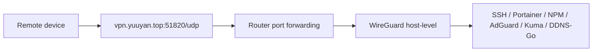
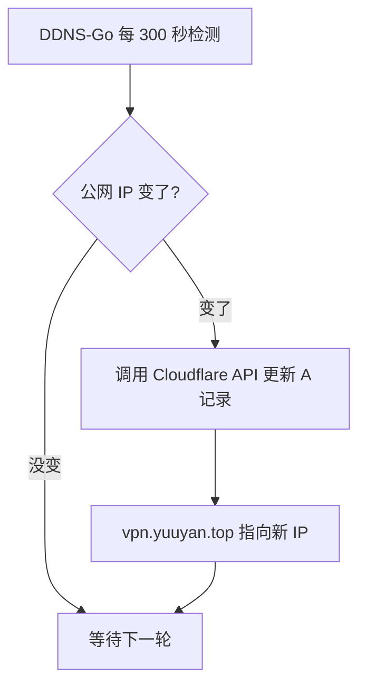

# WireGuard + DDNS-Go 私有管理链路

本文档覆盖私有管理链路的设计决策、组件职责和关键配置要点。公网和内网链路见 [dual-nginx-design.md](dual-nginx-design.md)。

## 为什么迁移

之前使用 Tailscale 作为私有管理入口。迁移原因：

- Tailscale 依赖第三方协调服务器，控制面不在自己手里。
- 家庭宽带有公网 IPv4，具备自建 VPN 的条件。
- WireGuard 是内核级实现，性能开销低，配置透明。
- 减少一个外部依赖，排障链路更短。

不适合自建的场景：运营商 CGNAT（无公网 IP）、需要多节点 mesh 组网、需要 ACL 策略管理多用户。这些场景 Tailscale / Headscale 仍然是更合适的选择。

## 设计目标：网络层透明接入

WireGuard 在这里的定位是 L3 网络扩展，不是专用的远程管理通道。客户端接入后获得 `10.8.0.0/24` 地址并路由至 `192.168.31.0/24` 家庭网段，与 LAN 设备的网络可达性相同。

- 管理服务只需监听 LAN 或 WireGuard 网段，不需要额外的认证代理或隧道配置。
- 新增服务不需要额外配置访问路径，LAN 可达即远程可达。
- 排障时远程操作和本地操作使用相同的 IP、端口和协议。

与 Tailscale 方案的运维差异：

| 维度 | Tailscale | WireGuard（当前方案） |
| --- | --- | --- |
| 接入后网络模型 | Overlay 网络，服务通过 Tailscale IP 访问 | 路由至物理 LAN，服务通过原始内网地址访问 |
| 新增管理服务 | 需确认 Tailscale ACL 和网络可达性 | 无额外步骤，LAN 可达即远程可达 |
| 管理操作一致性 | 远程与本地使用不同地址和路径 | 远程与本地操作路径完全一致 |

## 方案架构



公网暴露面：

```text
51820/udp（WireGuard）
```

不暴露：

```text
80/tcp, 443/tcp
9876/tcp（DDNS-Go Web UI）
22/tcp（SSH）
Portainer / NPM / AdGuard / Uptime Kuma 管理端口
```

## 组件职责

| 组件 | 部署方式 | 负责什么 | 不负责什么 |
| --- | --- | --- | --- |
| WireGuard | 宿主机 systemd | VPN 隧道、Peer 认证、流量加密 | DNS 解析、动态 IP 更新 |
| DDNS-Go | Docker host 网络 | 动态更新 WireGuard 端点域名 | VPN 隧道、端口转发 |
| 路由器 | 硬件 | UDP 51820 端口转发 | VPN 认证、服务暴露 |
| firewalld | 宿主机 | 放行 WireGuard 端口、WireGuard 网段访问、masquerade | 应用层认证 |

### 为什么 WireGuard 部署在宿主机而不是 Docker

- 路由和 NAT 规则直接操作宿主机网络栈，不需要额外的 Docker 网络映射。
- firewalld 规则和 ip forward 配置更直观。
- 排障时 `wg show`、`ip route`、`iptables` 都在同一个 namespace，不用进容器。

### 为什么 DDNS-Go 使用 host 网络

- DDNS-Go 需要获取主机网络状态来判断当前公网 IP。
- host 网络模式下可以直接绑定指定端口，不需要端口映射。

## 安全约束

- 路由器只转发 `51820/udp`，不转发任何管理端口。
- 每台客户端一个独立 Peer，丢失设备立即删除对应 Peer。
- DDNS-Go Token 使用最小权限，只允许修改指定域名记录。
- 管理服务（Portainer、NPM、AdGuard、Kuma 后台、DDNS-Go）只允许 LAN 或 WireGuard 网段访问。
- WireGuard 私钥、客户端配置、DDNS Token 不提交到 Git。

## 统一入口：DDNS-Go 解决动态 IP 问题

家庭宽带的公网 IP 不是固定的，运营商会在 PPPoE 重拨或租约到期时分配新 IP。如果客户端 Endpoint 写死 IP，每次变动都要手动更新所有设备的 WireGuard 配置。

DDNS-Go 解决这个问题：它定期检测当前公网 IP，一旦发现变化就自动调用 Cloudflare API 更新 DNS 记录。客户端 Endpoint 写域名而不是 IP，域名始终指向最新的家庭公网地址。

```text
客户端配置:
  Endpoint = vpn.yuuyan.top:51820

DDNS-Go 维护:
  vpn.yuuyan.top  ->  A 记录  ->  当前家庭公网 IPv4
```

所有客户端只需要记住 `vpn.yuuyan.top:51820` 这一个入口，IP 怎么变都不用管。

### 工作流程



### DDNS-Go Web UI 配置

在 `http://192.168.31.178:9876` 中配置：

| 项目 | 值 |
| --- | --- |
| DNS 服务商 | Cloudflare |
| Token | Cloudflare API Token，只授权修改 `vpn.yuuyan.top` |
| 域名 | `vpn.yuuyan.top` |
| 记录类型 | `A`（IPv4） |
| IP 获取方式 | 通过网卡 / 通过接口查询（按实际网络环境选择） |
| 更新频率 | 300 秒 |

### Cloudflare Token 最小权限

创建 Cloudflare API Token 时：

- 权限选 `Zone - DNS - Edit`。
- Zone Resources 限定到 `yuuyan.top`。
- 不要使用 Global API Key，它拥有账户全部权限。

这样 DDNS-Go 只能修改 DNS 记录，不能动 Cloudflare 的其他设置（Page Rules、Firewall、Tunnel 等）。

### IP 变动时客户端会断吗

会短暂断开。恢复过程：

1. DDNS-Go 在下一个检测周期（最多 300 秒）发现变化并更新 DNS。
2. DNS 记录生效取决于 TTL（建议设为 60-300 秒）。
3. WireGuard 客户端在下次握手时重新解析 Endpoint 域名，拿到新 IP 后自动恢复。

整个过程通常几分钟内完成，不需要手动干预。`PersistentKeepalive = 25` 会让客户端每 25 秒尝试握手，恢复更快。

### 为什么不直接用固定 IP

- 家庭宽带默认动态 IP，申请固定 IP 需要额外费用或商业套餐。
- DDNS 方案零成本，对个人 HomeLab 足够可靠。
- 即使 IP 一个月只变一次，手动更新多台设备的 Endpoint 也很烦。

## 关键配置要点

### DDNS-Go（Docker Compose）

```yaml
services:
  ddns-go:
    image: jeessy/ddns-go:latest
    container_name: ddns-go
    restart: unless-stopped
    network_mode: host
    environment:
      - TZ=Asia/Shanghai
    volumes:
      - /data/compose/ddns-go:/root
    command: ["-l", "0.0.0.0:9876", "-f", "300"]
```

### WireGuard 服务端（wg0.conf 结构）

```ini
[Interface]
Address = 10.8.0.1/24
ListenPort = 51820
PrivateKey = <server_private_key>

PostUp = iptables -A FORWARD -i wg0 -j ACCEPT; iptables -A FORWARD -o wg0 -j ACCEPT; iptables -t nat -A POSTROUTING -s 10.8.0.0/24 -o <出口网卡> -j MASQUERADE
PostDown = iptables -D FORWARD -i wg0 -j ACCEPT; iptables -D FORWARD -o wg0 -j ACCEPT; iptables -t nat -D POSTROUTING -s 10.8.0.0/24 -o <出口网卡> -j MASQUERADE

[Peer]
PublicKey = <client_public_key>
AllowedIPs = 10.8.0.2/32
```

出口网卡通过 `ip route get 1.1.1.1` 确认。每个客户端分配独立 IP（`/32`）。

### 客户端 AllowedIPs 策略

```ini
AllowedIPs = 10.8.0.0/24, 192.168.31.0/24
```

分流模式：只有 WireGuard 网段和家庭 LAN 走 VPN，其他公网流量走当前网络。不使用 `0.0.0.0/0` 全局代理，除非明确需要。

### 路由器端口转发

```text
协议: UDP
外部端口: 51820
内部 IP: 192.168.31.178
内部端口: 51820
```

只此一条，不转发其他端口。

## 与 Tailscale 对比

| | Tailscale | WireGuard + DDNS-Go |
| --- | --- | --- |
| 控制面 | Tailscale 协调服务器 | 完全自主 |
| 公网 IP 要求 | 不需要（有中继） | 需要公网 IPv4 |
| 部署复杂度 | 低（一键安装） | 中（需配置防火墙、路由、DDNS） |
| 多节点 mesh | 原生支持 | 需要手动配置 |
| ACL 管理 | Web 控制台 | 手动编辑 wg0.conf |
| 性能 | 好 | 好（内核级） |
| 外部依赖 | Tailscale 服务 | DNS 服务商 API |
| 适合场景 | CGNAT、多节点、团队 | 有公网 IP、单节点、个人 |

## 相关文档

- [README.md](../README.md)
- [双 Nginx 入口架构](dual-nginx-design.md)
- [运维指南](operations-guide.md)
- [DDNS-Go Compose 示例](../examples/compose/ddns-go/)
